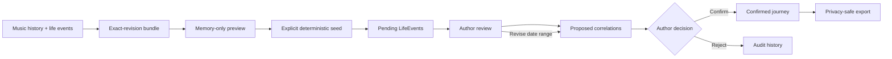

# Storywalker Studio

## Turn fragmented digital traces into an author-controlled journey.

Storywalker Studio is an author-controlled system for reconstructing personal journeys from fragmented digital traces. It correlates music history and life events while preserving uncertainty, privacy, provenance, and human editorial control.

[](https://github.com/adinapirjol/storywalker-studio/actions/workflows/ci.yml)


The system is deliberately deterministic first. It does not claim that a song explains an event because their timestamps are close. It proposes a connection, shows the temporal evidence and its uncertainty, and waits for an Author to confirm or reject it.

> **Fictional demonstration data:** Aurora Coast is invented for this public repository. Every song, artist, person, event, note, identifier, and timestamp in the committed demo is fictional.

## Why Storywalker exists

Personal archives are fragmented across playlists, timestamps, photographs, notes, tickets, calendars, and memory. Automated storytelling tools often flatten those fragments into a smooth narrative, quietly turning an estimate into a date or proximity into meaning.

Storywalker Studio keeps the seams visible. Exact times remain exact. Day-level memories remain day-level. Approximate ranges remain ranges. A match is a proposal until the Author makes a decision.

## The Author stays in control

The review loop separates machine-verifiable evidence from autobiographical meaning:



No demo data is persisted during preview. Seeding is explicit. LifeEvents begin pending. Editing an uncertain event window regenerates temporal proposals and retains invalidated proposals as audit history.


## Explore Aurora Coast

**Aurora Coast — Chapter One: Ten Days in Transit** is a fictional Euro-summer journey set from 18–27 July 2027:

**Ljubljana → Afterlight Fields → Venice → Piran → Vienna → Berlin**

Afterlight Fields is a fictional festival. The chapter moves from unsettled arrival weather and a temporary volunteer community to a quieter coast, then ends on an overnight bus as a birthday approaches.

The committed bundle contains:

- exactly **12 synthetic tracks**, with fictional Spotify-style IDs and metadata;
- exactly **8 fictional LifeEvents**, mixing exact timestamps, bounded ranges, and day-level certainty;
- public, friends-only, and private records;
- competing temporal proposals;
- a suggested rejection;
- an uncertain Venice window that changes after Author input.

The full deterministic proposal set remains available as an evidence ledger, not an equal-priority to-do list. The guided review follows a curated confirmation, rejection, and date-range revision, while the workspace surfaces the 18 most relevant active proposals first.


## Try it in under a minute

Requires Node.js 22 or newer.

```bash
npm ci
npm run demo:aurora-coast
npm run dev
```

When Next.js reports that it is ready, open the local address shown in the terminal. Choose **Load Aurora Coast Demo**, verify the memory-only preview, then choose **Seed Author workspace**.

No Spotify account, credentials, network connection, private file, or local editorial export is required for the demo.

## Orientation infrastructure: Vault → Atlas Now → Scenario Studio

The local product now has a private orientation path beside the fictional Aurora Coast demonstration:

1. **Vault** (`/vault`) is the consent-first, encrypted local evidence field. Imports, captures, and editorial candidates remain private and pending by default. Unlocking creates a browser-wide local session with an opaque HTTP-only cookie; the key remains only in the local server process and the session expires after 15 minutes or an explicit lock.
2. **Atlas Now** (`/atlas`) makes source changes, explicit wording overlaps, and bounded place readings legible. It is keyword/time retrieval, not semantic RAG, causal explanation, or a recommendation engine. Timeline and saved-place proximity are always candidate evidence, never a confirmed visit or commitment.
3. **Scenario Studio** (`/scenario-studio`) keeps possible routes side by side. The Author can name timing and conditions, draw explicit connections, and independently link or remove Atlas evidence lanes. It stores a revisable private constellation; it never ranks a route, creates an Episode or Journey, or promotes material to public work.

The three surfaces are intentionally interconnected through local record IDs, not through inferred personal meaning. A local clone opens with no private data and remains usable through the fictional demo.

## First run: see the shape, then make it yours

Open `/start` for the first-run path. It is intentionally two-sided:

- **Private Vault** (`/vault`) is the local encrypted notebook for evidence, imports, capture, and retrieval. Its short-lived browser-wide unlock is local to the running server and can be locked explicitly.
- **Atlas Now** (`/atlas`) is the private evidence map. It surfaces only explicit source changes and retrieval overlaps, with uncertainty still visible.
- **Scenario Studio** (`/scenario-studio`) is the private constellation board: routes can overlap and share evidence without being ranked or made canonical.
- **Public Voice** (`/voice`) is an encrypted draft shelf. A person searches their private Vault, deliberately selects up to eight evidence references, writes their own draft, then explicitly exports local Markdown. It never publishes to Medium, Substack, or a portfolio automatically.

The Spotify onboarding contract is read-only: it will use the connected account's recently played tracks and recommend up to four playlists owned by that account, excluding collaborative playlists by default. The selection is always shown for confirmation. A local clone remains fully usable in demo and import mode; frictionless provider authorization needs a registered OAuth client and a deployed/shared redirect configuration, which are intentionally not committed.

Google Maps Timeline and ChatGPT history are local, user-selected exports in this release. They are not treated as background account scraping. Any future external-model editor must remain a separately consented operation over a selected, redacted evidence window; it may not promote a correlation to fact or publication.

## What the demo proves

- **Deterministic correlation** — identical confirmed inputs produce the same proposals and ordering.
- **Exact-revision validation** — all bundle documents must share the expected schema revision and counts.
- **Uncertain time ranges** — exact, day-level, exact-range, and approximate-range evidence stay distinct.
- **Competing proposals** — one music trace may be temporally close to more than one event.
- **Privacy levels** — public, friends-only, and private material pass through an explicit export boundary.
- **Author confirmation** — only confirmed proposals can appear as connections in an export.
- **Author rejection** — rejected proposals remain non-canonical.
- **Regenerated proposals** — changing the Venice window invalidates a stale overlap without deleting its audit record.
- **Safe export** — pending, rejected, and out-of-scope private material are excluded.


## Use your own Spotify history

Spotify import is optional and server-side. Credentials and tokens never enter the browser bundle. The current importer reads playlist addition history available through Spotify’s Web API; it does not claim access to a complete lifetime listening history.

```bash
cp .env.example .env.local
# fill in the three variables locally
npm run spotify:authorize
npm run spotify:import -- --playlist YOUR_PLAYLIST_ID
```

Imported material is written beneath `private-data/spotify/` as an ignored `*.private.json` file. It is never required by Aurora Coast and is never committed by default. See [Spotify import and deletion](docs/spotify-import.md) for scopes, setup, storage, and deletion.

## Architecture

```text
Committed fictional bundle
        │
        ▼
Zod revision + schema gate ──► memory-only preview
        │
        ▼ explicit action
Local Author workspace ──► deterministic correlation
        │                         │
        │                  pending proposals
        │                         ▼
        └──────────────► Author decisions
                                  │
                                  ▼
                         privacy-filtered Markdown

Optional Spotify CLI ──► ignored private-data/ directory
        (Node only; never imported by the browser app)

Private Vault ──► Atlas Now ──► Scenario Studio
  encrypted local       retrieval-only      revisable constellation
  consented sources     evidence lanes      no ranking or promotion
```

The domain and transformation functions live in `lib/`. The Next.js client is a review surface over those pure functions. `localStorage` is used only after explicit demo seed and is described honestly as demo persistence, not durable archival storage. The separate Vault is an encrypted local SQLite store under ignored `private-data/`; it is never part of the demo bundle or browser build.

Read [the architecture note](docs/architecture.md), [privacy model](docs/privacy-model.md), and [orientation release notes](docs/release-notes.md) for the boundaries in detail.

## Local private recovery staging

Recovered personal evidence belongs only under ignored `private-data/storywalker/`. The recovery importer is dry-run by default and requires absolute paths for the machine-readable ledger plus its three human-review companions:

```bash
npm run private:import -- recovery --ledger /absolute/path/ledger.json --author-review /absolute/path/review.md --gaps /absolute/path/gaps.md --import-prompt /absolute/path/import-prompt.md
# only after reviewing the report
npm run private:import -- recovery --ledger /absolute/path/ledger.json --author-review /absolute/path/review.md --gaps /absolute/path/gaps.md --import-prompt /absolute/path/import-prompt.md --write-private
```

The ledger is the source of truth. Companion files are staged as provenance and unanswered-question context; they never silently rewrite a ledger record. The importer merges by stable Moment ID, preserves prior local decisions, creates an explicit private conflict instead of overwriting changed reviewed evidence, and creates no Episode. Playlist IDs are retained without Spotify share parameters; an application, planned set, or playlist entry is not evidence of submission, attendance, or playback.

The local review route is intentionally separate from Aurora Coast. It keeps evidence decisions, proposal refusals, exclusions, contradictions, and unknowns private; accepting evidence does not accept an editorial proposal or canonise a Moment, Journey, Thread, or Episode. To remove staged data safely, stop the local server and delete only the specific ignored `private-data/storywalker/` recovery file you no longer need. `npm run audit` checks committable paths and, when a staged recovery is present, also verifies that its IDs and source phrases do not appear in public files.

## Research Lab — CTM 2027 preparation

`/research` is a restrained, public practice-based artistic-research layer. It tracks verified CTM 2027 call facts (checked 23 August 2026), separates those facts from working inferences, and keeps the current question provisional:

> **Refusal Is an Editorial Act: Who Gets to Author the Memory?**

It includes two small, fictional experiments. They do not introduce an external model, a user account, analytics, or a public autobiographical timeline.

- **Experiment 01 — Refusal:** a fictional Aurora Coast proposal can be accepted, revised, or refused. Each response changes a visual trace and a copyright-safe synthetic audio consequence; the experiment remains outside the canonical journey export.
- **Experiment 02 — Locative Echo Lab:** a browser-only study of circular GPS geofences and sound triggers, inspired by general locative-audio practice. Its desktop simulation requires no map or external service. Live location is opt-in, in-memory, accuracy-aware, and stopped on pause, exit, and unmount.

Run `npm run dev`, then open `/research`, `/research/refusal`, or `/research/echo-lab`. Audio and GPS are optional: each experiment has textual alternatives and manual controls. The experiments demonstrate bounded interaction mechanics, not proof that a song explains a memory or that location proves meaning.

Public research templates and the dated 23 August 2026 checkpoint are in [`docs/research/ctm-2027/`](docs/research/ctm-2027/). Private notebook entries, local audio selections, personal imports, and Author decisions remain ignored local material.

## Repository structure

```text
app/                         Next.js routes, local API, and visual language
components/                  Author review, Vault, Atlas, Scenario, and research surfaces
examples/aurora-coast/       Committed fictional demo bundle
lib/                         Schemas, correlation, private Vault, Atlas, Scenario, adapters
scripts/                     Demo verification, privacy audit, optional local import tools
docs/                        Architecture, privacy, demo, import, and release notes
.github/workflows/ci.yml     Credential-free quality gates
```

## Testing and quality checks

```bash
npm test
npm run typecheck
npm run lint
npm run build
npm run audit:public
npm run audit:build-private
npm run audit
```

`npm run audit:public` checks visible repository files for forbidden private paths, tracked token caches, private JSON, absolute user paths, selected private-journey markers, and common credential-shaped values. It is a focused backstop, not a substitute for human review.

CI runs the same checks from a lockfile-enforced install and requires no Spotify credentials.

## Design principles

- **Deterministic first.** Generate reproducible evidence before interpretation.
- **Uncertainty is data.** Do not promote an estimate into a fact.
- **The Author decides meaning.** Temporal proximity is evidence, not autobiography.
- **Privacy is structural.** Filter at ingestion, persistence, and export boundaries.
- **Provenance survives edits.** Revised proposals leave an audit trail.
- **A notebook, not a dashboard.** The interface favors reading, attention, and editorial calm.

## What this project demonstrates

Every claim below is checkable in this repository:

- **Deterministic data systems** — a pure correlation pass in `lib/correlation.ts` produces identical proposal IDs and ordering for identical confirmed input, verified in `lib/demo.test.ts`.
- **Temporal uncertainty modelling** — exact, day-level, and ranged evidence stay distinct from schema (`lib/schema.ts`) through review to export, and are never silently promoted to facts.
- **Human-in-the-loop interaction design** — `lib/review-state.ts` and the workspace in `components/` make Author confirmation, rejection, and date revision the only path from evidence to narrative.
- **Privacy-aware architecture** — explicit filters at ingestion, encrypted local persistence, Atlas derivation, and export boundaries, documented in [the privacy model](docs/privacy-model.md).
- **Server-side API integration** — the optional Spotify importer lives in Node-only modules, with `lib/browser-boundary.test.ts` proving credentials never reach the browser bundle.
- **Reproducible verification** — credential-free CI, a deterministic fixture check, and a public-repository audit script in `scripts/`.

## Roadmap

- Scenario snapshots and source-ID references beyond the single current constellation.
- Author-readable curation queues for pending captures and bounded Timeline evidence.
- Additional consented local adapters for photographs and notes.
- A separately consented semantic retrieval adapter, with an inspectable preview and no automatic promotion.
- Portable encrypted project bundles and a documented restore/migration path.

## Open source

Storywalker Studio is released under the [MIT License](LICENSE). Contributions are welcome through [CONTRIBUTING.md](CONTRIBUTING.md); security reports follow [SECURITY.md](SECURITY.md).

Created by [Adina Pirjol](https://github.com/adinapirjol).
