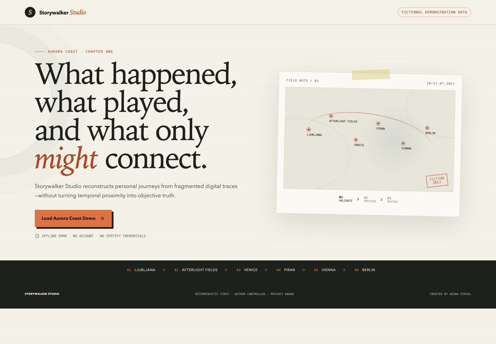
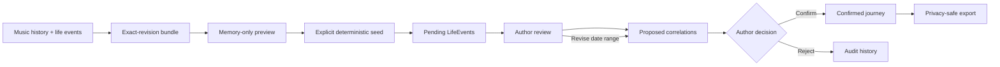
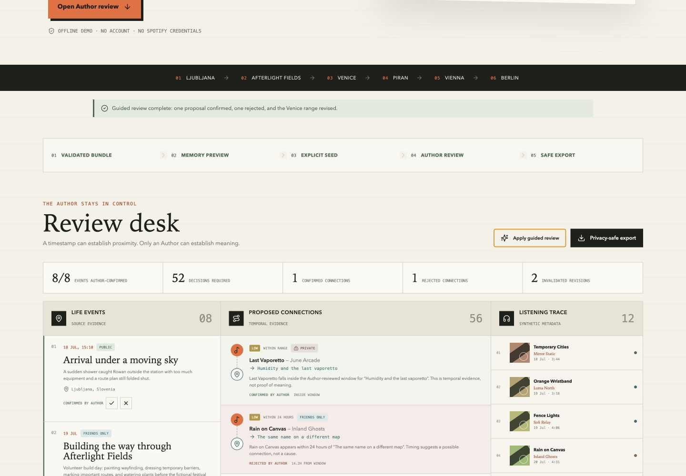
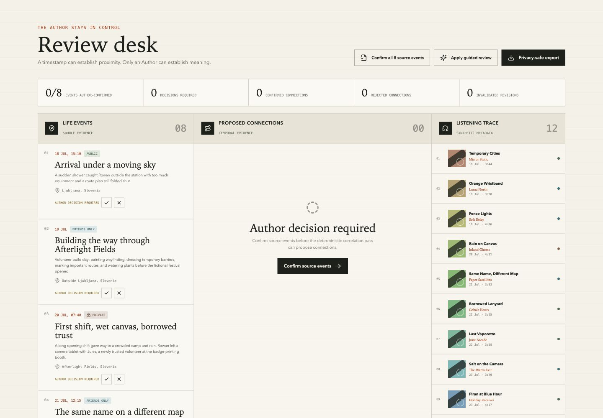
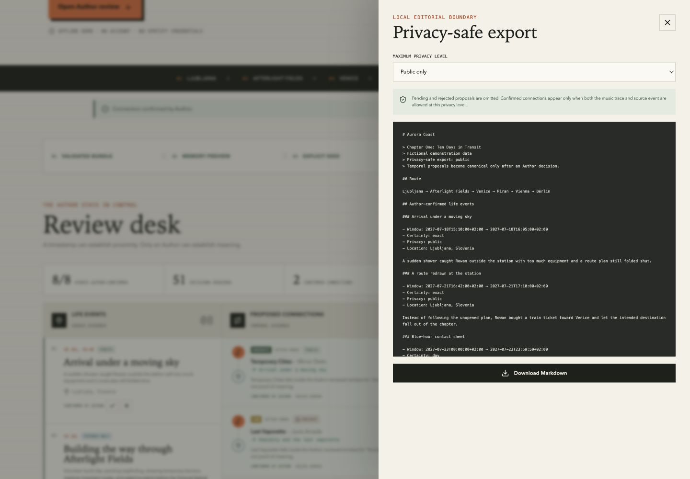

# Storywalker Studio

## Turn fragmented digital traces into an author-controlled journey.

Storywalker Studio is an author-controlled system for reconstructing personal journeys from fragmented digital traces. It correlates music history and life events while preserving uncertainty, privacy, provenance, and human editorial control.

[](https://github.com/adinapirjol/storywalker-studio/actions/workflows/ci.yml)



The system is deliberately deterministic first. It does not claim that a song explains an event because their timestamps are close. It proposes a connection, shows the temporal evidence and its uncertainty, and waits for an Author to confirm or reject it.

> **Fictional demonstration data:** Aurora Coast is invented for this public repository. Every song, artist, person, event, note, identifier, and timestamp in the committed demo is fictional.

## Why Storywalker exists

Personal archives are fragmented across playlists, timestamps, photographs, notes, tickets, calendars, and memory. Automated storytelling tools often flatten those fragments into a smooth narrative, quietly turning an estimate into a date or proximity into meaning.

Storywalker Studio keeps the seams visible. Exact times remain exact. Day-level memories remain day-level. Approximate ranges remain ranges. A match is a proposal until the Author makes a decision.

## The Author stays in control

The review loop separates machine-verifiable evidence from autobiographical meaning:



No demo data is persisted during preview. Seeding is explicit. LifeEvents begin pending. Editing an uncertain event window regenerates temporal proposals and retains invalidated proposals as audit history.



## Explore Aurora Coast

**Aurora Coast — Chapter One: Ten Days in Transit** is a fictional Euro-summer journey set from 18–27 July 2027:

**Ljubljana → Afterlight Fields → Venice → Piran → Vienna → Berlin**

Afterlight Fields is a fictional festival. The chapter moves from unsettled arrival weather and a temporary volunteer community to a quieter coast, then ends on an overnight bus as a birthday approaches.

The committed bundle contains:

- exactly **12 synthetic tracks**, with fictional Spotify-style IDs and metadata;
- exactly **8 fictional LifeEvents**, mixing exact timestamps, bounded ranges, and day-level certainty;
- public, friends-only, and private records;
- competing temporal proposals;
- a suggested rejection;
- an uncertain Venice window that changes after Author input.

The full deterministic proposal set remains available as an evidence ledger, not an equal-priority to-do list. The guided review follows a curated confirmation, rejection, and date-range revision, while the workspace surfaces the 18 most relevant active proposals first.



## Try it in under a minute

Requires Node.js 22 or newer.

```bash
npm ci
npm run demo:aurora-coast
npm run dev
```

When Next.js reports that it is ready, open the local address shown in the terminal. Choose **Load Aurora Coast Demo**, verify the memory-only preview, then choose **Seed Author workspace**.

No Spotify account, credentials, network connection, private file, or local editorial export is required for the demo.

## What the demo proves

- **Deterministic correlation** — identical confirmed inputs produce the same proposals and ordering.
- **Exact-revision validation** — all bundle documents must share the expected schema revision and counts.
- **Uncertain time ranges** — exact, day-level, exact-range, and approximate-range evidence stay distinct.
- **Competing proposals** — one music trace may be temporally close to more than one event.
- **Privacy levels** — public, friends-only, and private material pass through an explicit export boundary.
- **Author confirmation** — only confirmed proposals can appear as connections in an export.
- **Author rejection** — rejected proposals remain non-canonical.
- **Regenerated proposals** — changing the Venice window invalidates a stale overlap without deleting its audit record.
- **Safe export** — pending, rejected, and out-of-scope private material are excluded.



## Use your own Spotify history

Spotify import is optional and server-side. Credentials and tokens never enter the browser bundle. The current importer reads playlist addition history available through Spotify’s Web API; it does not claim access to a complete lifetime listening history.

```bash
cp .env.example .env.local
# fill in the three variables locally
npm run spotify:authorize
npm run spotify:import -- --playlist YOUR_PLAYLIST_ID
```

Imported material is written beneath `private-data/spotify/` as an ignored `*.private.json` file. It is never required by Aurora Coast and is never committed by default. See [Spotify import and deletion](docs/spotify-import.md) for scopes, setup, storage, and deletion.

## Architecture

```text
Committed fictional bundle
        │
        ▼
Zod revision + schema gate ──► memory-only preview
        │
        ▼ explicit action
Local Author workspace ──► deterministic correlation
        │                         │
        │                  pending proposals
        │                         ▼
        └──────────────► Author decisions
                                  │
                                  ▼
                         privacy-filtered Markdown

Optional Spotify CLI ──► ignored private-data/ directory
        (Node only; never imported by the browser app)
```

The domain and transformation functions live in `lib/`. The Next.js client is a review surface over those pure functions. `localStorage` is used only after explicit seed and is described honestly as demo persistence, not durable archival storage.

Read [the architecture note](docs/architecture.md) and [privacy model](docs/privacy-model.md) for the boundaries in detail.

## Repository structure

```text
app/                         Next.js shell and visual language
components/                  Author-review workspace
examples/aurora-coast/       Committed fictional demo bundle
lib/                         Schemas, correlation, review, export, server-only Spotify
scripts/                     Demo verification, public audit, optional Spotify CLI
docs/                        Architecture, privacy, demo, import, release notes
.github/workflows/ci.yml     Credential-free quality gates
```

## Testing and quality checks

```bash
npm test
npm run typecheck
npm run lint
npm run build
npm run audit:public
```

`npm run audit:public` checks visible repository files for forbidden private paths, tracked token caches, private JSON, absolute user paths, selected private-journey markers, and common credential-shaped values. It is a focused backstop, not a substitute for human review.

CI runs the same checks from a lockfile-enforced install and requires no Spotify credentials.

## Design principles

- **Deterministic first.** Generate reproducible evidence before interpretation.
- **Uncertainty is data.** Do not promote an estimate into a fact.
- **The Author decides meaning.** Temporal proximity is evidence, not autobiography.
- **Privacy is structural.** Filter at ingestion, persistence, and export boundaries.
- **Provenance survives edits.** Revised proposals leave an audit trail.
- **A notebook, not a dashboard.** The interface favors reading, attention, and editorial calm.

## Roadmap

- Restore and migration tools for long-lived local notebooks.
- Author-editable proposal wording with preserved originals.
- Additional local import adapters for calendars, photographs, and notes.
- A documented, opt-in external-model boundary with preview and explicit consent.
- Portable encrypted project bundles.

## Open source

Storywalker Studio is released under the [MIT License](LICENSE). Contributions are welcome through [CONTRIBUTING.md](CONTRIBUTING.md); security reports follow [SECURITY.md](SECURITY.md).

Created by [Adina Pirjol](https://github.com/adinapirjol).
