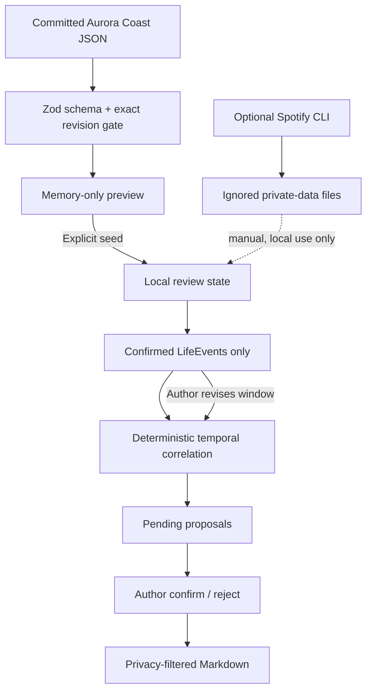

# Architecture

Storywalker Studio separates source evidence, deterministic transformations, Author decisions, and export.

## Boundaries

The browser application never imports the Spotify server module or CLI scripts. The public demo imports only committed fictional JSON.

## Schemas

`lib/schema.ts` is the runtime boundary. It validates:

- a 12-record synthetic music timeline;
- an 8-record fictional LifeEvent document;
- the exact `aurora-coast-r1-2027-07` review bundle;
- privacy, temporal certainty, review states, and proposal states;
- a versioned local workspace snapshot.

All source documents must share one exact revision and match the counts declared by the review bundle before preview succeeds.

## Deterministic correlation

`lib/correlation.ts` compares a track’s timestamp with Author-confirmed LifeEvent windows. It emits only four explainable bases:

1. within the event range;
2. on the same local day;
3. within 24 hours of the nearest boundary;
4. within 72 hours of the nearest boundary.

Confidence is capped by the evidence. An approximate range cannot produce more than low temporal confidence. Stable inputs and a fixed evaluation time produce stable IDs, reasons, and ordering.

The algorithm does not inspect titles or notes for emotional similarity. It cannot claim why a track was played or added.

## Review-state regeneration

LifeEvents begin `pending`. Only confirmed events are correlation-eligible. When an Author changes a range:

- eligible proposals are regenerated;
- proposals with the same relationship retain an Author decision;
- no-longer-eligible proposals become `invalidated`;
- invalidated records remain available as audit history.

Rejection is also retained and never becomes canonical export material.

## Export boundary

`lib/export.ts` applies the chosen maximum privacy level before rendering Markdown. A confirmed proposal is exportable only if both its track and LifeEvent are eligible at that privacy level. Pending, rejected, and invalidated proposals are omitted.

## Persistence

Preview is memory-only. The browser writes one versioned `localStorage` record only after explicit seeding. This is suitable for a reproducible demonstration, not for irreplaceable archives. Durable restore, migration, and encryption remain roadmap work.
