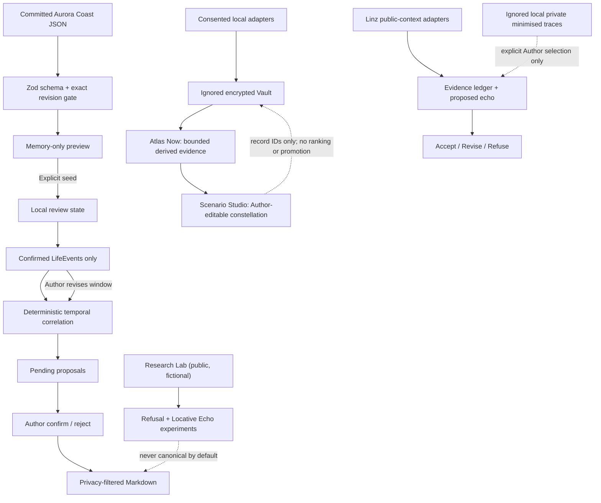

# Architecture

Storywalker Studio separates source evidence, deterministic transformations, Author decisions, and export.

## Boundaries

The browser application never imports the Spotify server module or CLI scripts. The public demo imports only committed fictional JSON. Vault, Atlas Now, and Scenario Studio are dynamic local routes; their private records live only in the ignored Vault.

## Vault, Atlas Now, and Scenario Studio

Vault stores explicitly consented source records and captures in encrypted local SQLite. The passphrase is used to open the Vault but is never written to the browser. An unlock creates a random opaque HTTP-only, same-site cookie whose matching encryption key exists only in the local Node process. Its expiry is absolute at 15 minutes, is not extended by activity, and an explicit lock removes the process entry and cookie. Restarting the local server also invalidates every session.

Atlas Now is a derived local view, not a second source of truth. It groups retained import records, maps fixed evidence-lane definitions over explicit source terms/types, and displays change records only until a manual Atlas refresh acknowledges them. Timeline place readings rank labels already present in private sources; they do not reverse-geocode, assert a visit, or create canon.

Scenario Studio stores one Author-owned private constellation. It holds pathway timing, stated conditions, explicit links, and independent evidence-lane selections keyed by stable lane ID. A legacy flat record-ID list is preserved during migration so loading the view cannot silently discard evidence. Selecting or removing one lane changes only that lane; shared source IDs remain selected while another linked lane references them.

## Private recovery staging

The recovery importer is Node-only and begins with a parse-and-validate dry run. Its inputs must be absolute paths: one machine-readable ledger and three companion files. It writes only after `--write-private`, to the ignored `private-data/storywalker/` location with owner-only permissions.

The staging document has a versioned schema and retains source order, candidate Moments, provisional Journeys, assistant-proposed Threads, claim-level evidence statuses, provenance, uncertainty, contradictions, aliases, music encounters, and companion text. Episodes are structurally an empty collection: neither staging nor Author actions can generate one. The review surface derives a display order from Journey and temporal certainty without mutating source order.

Stable Moment IDs drive idempotent merge. Identical records are unchanged. A changed record with the same ID keeps the reviewed local record and incoming source side-by-side in an explicit Author conflict; existing decisions are never overwritten. Every imported Moment is private, pending, and non-canonical. A restricted Moment remains restricted because all transitions operate on a separate decision ledger rather than rewriting source privacy.

## Research Lab boundaries

`/research` is a public practice-based research layer, separate from the seeded Aurora Coast workspace. Its CTM tracker and templates are committable; they contain no private notebook entry. The experiments use fictional fixtures and synthetic sound.

Experiment 01 records an accept/revise/refuse state in component memory. The original wording is retained for revision, refusal remains in the experiment audit, and no experiment state enters `exportJourneyMarkdown` without a future explicit Author decision.

Experiment 02 keeps geofence processing pure in `lib/locative.ts`. Simulation uses fictional coordinates. A live browser watcher begins only after an acknowledgement and explicit button press, keeps only the current position in memory, treats poor accuracy as uncertain rather than precisely triggered, and is cleared when paused or the component leaves.

The optional Spotify importer remains Node-only. It retains every source-positioned playlist occurrence (including duplicate tracks), reports null timestamps and unavailable items, stores raw provider order separately from a timestamp-sorted view, and writes its local snapshot/delta only under ignored `private-data/`.

## Public City, Private Echoes — Linz adapter

`lib/public-context.ts` defines city-independent public-context and minimised-private-trace interfaces. `lib/linz-experiment.ts` is a bounded Linz configuration, not a second application: it exposes three public programme records, a replaceable City adapter boundary, and three synthetic private stand-ins for the public build. The locally exported `locative-echo` manifest carries only generalised labels and `null` coordinates.

Every Linz echo has an evidence ledger: stable source IDs, timezone, location precision, relationship type, uncertainty, missing information, transformation history and the current Author decision. `recorded`, `inferred`, `authored`, and `refused` remain distinct. Only explicit Accept or Revise can set an authored state; Refuse remains visible.

`lib/linz-adapters.ts` preserves original and normalised street names, and returns matched, ambiguous or unmatched results. A street-history record gains geometry only through one unique geolocated record; no coordinate is inferred from a name.

## Schemas

`lib/schema.ts` is the runtime boundary. It validates:

- a 12-record synthetic music timeline;
- an 8-record fictional LifeEvent document;
- the exact `aurora-coast-r1-2027-07` review bundle;
- privacy, temporal certainty, review states, and proposal states;
- a versioned local workspace snapshot.

All source documents must share one exact revision and match the counts declared by the review bundle before preview succeeds.

## Deterministic correlation

`lib/correlation.ts` compares a track’s timestamp with Author-confirmed LifeEvent windows. It emits only four explainable bases:

1. within the event range;
2. on the same local day;
3. within 24 hours of the nearest boundary;
4. within 72 hours of the nearest boundary.

Confidence is capped by the evidence. An approximate range cannot produce more than low temporal confidence. Stable inputs and a fixed evaluation time produce stable IDs, reasons, and ordering.

The algorithm does not inspect titles or notes for emotional similarity. It cannot claim why a track was played or added.

## Review-state regeneration

LifeEvents begin `pending`. Only confirmed events are correlation-eligible. When an Author changes a range:

- eligible proposals are regenerated;
- proposals with the same relationship retain an Author decision;
- no-longer-eligible proposals become `invalidated`;
- invalidated records remain available as audit history.

Rejection is also retained and never becomes canonical export material.

## Export boundary

`lib/export.ts` applies the chosen maximum privacy level before rendering Markdown. A confirmed proposal is exportable only if both its track and LifeEvent are eligible at that privacy level. Pending, rejected, and invalidated proposals are omitted.

The private recovery document and the encrypted Vault are not inputs to `lib/export.ts`, the public demo seed, or the browser bundle. Their local API routes are dynamic and require an explicit browser-wide Vault unlock.

## Persistence

Preview is memory-only. The browser writes one versioned `localStorage` record only after explicit demo seeding; this is suitable for a reproducible demonstration, not for irreplaceable archives. Private evidence uses the separate encrypted local Vault. Portable encrypted backups and cross-machine restore remain future work.
