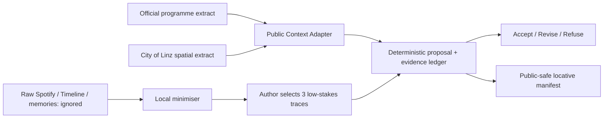

# Data flow and privacy note

Raw exports never enter Git, a browser bundle, screenshots, a public API route, or an AI prompt. Spotify audio is not copied: only optional URI/metadata/deep link is retained locally. There is no analytics, background tracking or automatic persistence. Simulated location is default; live GPS is separate, opt-in, shows reported precision and offers stop/reset.

The minimiser does not import an entire history for this prototype. It accepts a deliberately selected small file, supports dry run, reports schema and discarded fields, and writes only a local derivative. Timeline visits remain platform-inferred until an Author corrects or approves them.

To prepare the exact three local records, use `npm run linz:private-traces -- --input /absolute/path/to/three-selected-traces.json --dry-run`. The validator requires a generalised location, approximate interval, song/URI, occurred sentence, one accepted interpretation, one plausible refused interpretation, provenance and `local-private` classification for each record. It does not invent private content.
